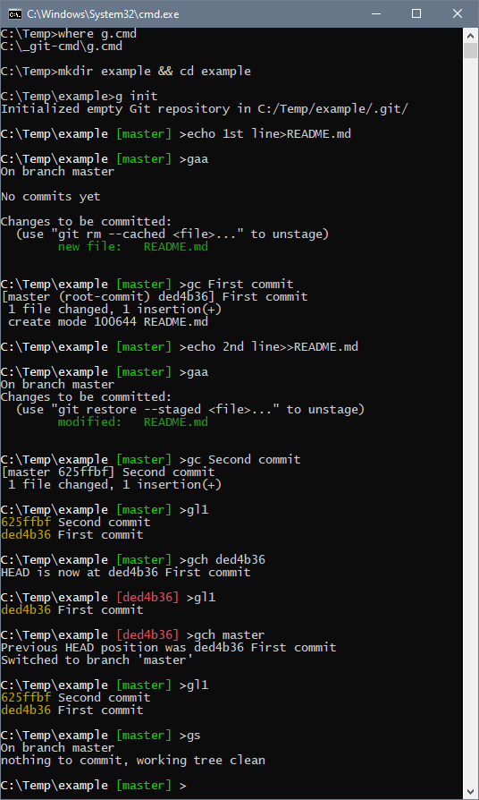

# Git CMD

This tool adds support for Git in CMD similarly like [Git in Bash](https://git-scm.com/book/en/v2/Appendix-A%3A-Git-in-Other-Environments-Git-in-Bash) or [Git in PowerShell](https://git-scm.com/book/en/v2/Appendix-A%3A-Git-in-Other-Environments-Git-in-PowerShell) — TL;DR See [Example](#example)
- This is native solution using only `git.exe` from installer available on [Git-SCM.COM](https://git-scm.com/download/win) and `cmd.exe` magic \
(basically this is set of `.cmd` files updating the `PROMPT` environment variable)
- It is different to `git-cmd.exe`, because it does not have any enhancements
- It is different to `git-bash.exe`, because it is "MINGW64" and paths looks like `/c/temp`

## It brings
1. [Shortcuts](#shortcuts-scissors)
2. [Branch name](#branch-name-deciduous_tree)
3. [Colors](#colors-rainbow)

#### Shortcuts :scissors:
Typing `git status <┘` hundred times a day is pretty boring. [Git Aliases](https://git-scm.com/book/en/v2/Git-Basics-Git-Aliases) helps, but it is still `git st <┘` \
Every keystroke counts, so based on how often I use particular command (or command chain) I have defined shortcuts
- Type `gs <┘` instead of `git status <┘` (and save 8 keystrokes)
- Type `gl1 <┘` instead of `git log --oneline <┘`
- Type `g ... <┘` instead of `git ... <┘`
- Type `git ... <┘` to reach `git.exe` for the classic (there is no `git.cmd` to avoid conflict)
- Remember that "with great power, comes great responsibility", so mistakes can be devastating :warning:

#### Branch name :deciduous_tree:
Branch name is in square brackets and the prompt may look like `C:\Temp\example [master] >` \
Detached head is supported, so it may contain also commit hash `C:\Temp\example [ded4b36] >` \
There are 3 environment variables:
- `%GitBranch%` branch name from repository retrieved by `gprompt`
- `%GitError%` keeps exit code to reset prompt to default if git command fails
- `%GitPushBranch%` same as `%GitBranch%` if not defined as parameter for `gpho` or `gpho!`

#### Colors :rainbow:
Green is normal branch \
Red is detached head \
Command prompt color is bold (light color shade) \
Uses ANSI escape codes, so it requires Windows 10 1909 and above :information_source: \
(for Windows 7 or Windows 10 before 1909 it will show directly the ANSI codes) :warning:

## Example
